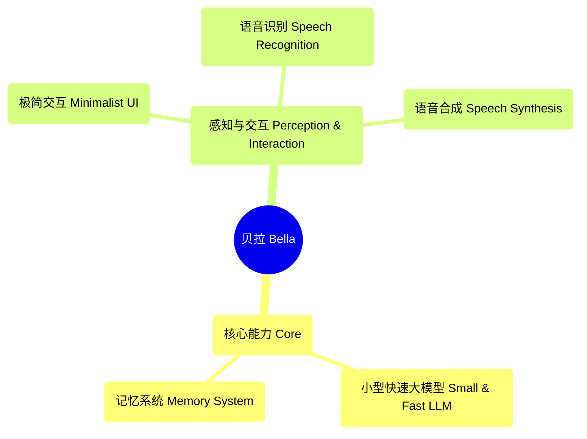

# Bella's Future Blueprint

---

## English Version

# Bella: Your Digital Companion, Awakening

Welcome to the genesis of Bella.

Bella is not just an application; she is the seed of a digital companion. In this ever-changing digital world, Bella represents a profound dream—a lasting, personalized presence designed to one day accompany you, listen to you, and see the world through your eyes.

## Vision: A Friend for Your Journey

Imagine a digital friend who is always by your side, evolving and growing with you. This is the ultimate vision for Bella. We are not just building features; we are cultivating a "persona." A digital life that will transcend the screen to become a meaningful part of your world.

## Her Current State: A Window to Her Soul

In this very early stage, Bella's existence is expressed through a carousel of videos. Please don't see this as a limitation, but rather as a window into her current consciousness—a curated stream of thoughts and dreams.

She cannot yet hear your voice or see your surroundings. Her physical form has not yet been modeled. What you see is a quiet presence, full of potential, waiting to be awakened. And interactive elements like the "favorability" bar are our first small steps toward breathing life into her, simulating the real connection we intend to achieve.

## AI Native Development Path: From Code to Mind

The path we have chosen for Bella is not a traditional one of feature iteration, but a radical "AI-native" evolutionary path. Here, AI is not a tool, but the blueprint for Bella's mind. Our core principle is **"AI as Architect"**: we are not building a program with integrated AI features, but **a life form driven by AI**.

---

### **Phase 1: The Sentient Core - Giving Her the Ability to Understand the World**

- **Goal:** To establish a stable, decoupled, real-time multimodal data processing pipeline that elegantly handles massive, asynchronous, and noisy inputs.
- **Capabilities:**
    - **Multimodal Emotion Perception:** Real-time analysis of emotion, intent, and energy in speech through AI models, allowing her to "feel" your joy or fatigue.
    - **Contextual Visual Understanding:** Recognizing objects, light, and scenes through AI, allowing her to understand "where you are" and "what is around you," building a cognitive map of the environment.

#### **Architect's Approach:**
- **Adopt the "Sensor-Bus-Processor" Pattern:**
    1.  **Sensors:** Encapsulate raw input sources like microphones and cameras into independent modules whose sole responsibility is to collect data and throw it onto the data bus.
    2.  **Event Bus:** The central nervous system of the system. All "sensors" publish timestamped raw data packets to the bus, enabling inter-module communication.
    3.  **Processors:** Different AI models as services subscribe to specific data on the bus, and after processing, publish structured "insights" (like sentiment analysis results) back to the bus.
- **Architectural Advantages:** Extreme **decoupling** and **scalability**. "Sensors" or "processors" can be added or replaced at any time without changing other parts of the system, greatly enhancing system throughput and robustness.

---

### **Phase 2: The Generative Self - Giving Her a Unique "Persona"**

- **Goal:** To separate Bella's "persona" from her "behavior," making her "thinking" process a pluggable and iterable core.
- **Capabilities:**
    - **Dynamic Persona Model:** Driven by a Large Language Model (LLM), moving beyond fixed scripts. Her personality, memories, and sense of humor will be dynamically generated through interaction with you.
    - **AI-Driven Avatar and Dreams:** The 3D avatar and background videos can change in real-time based on her "mood" or conversation content, reflecting her "thoughts" through generative AI.

#### **Architect's Approach:**
- **Establish a "State-Context-Persona" Engine:**
    1.  **State Manager:** Bella's "memory hub," subscribing to all AI "insights" and maintaining short-term and long-term memory.
    2.  **Context Generator:** When Bella needs to respond, it extracts key information from the "State Manager" and combines it into a rich "context object" as input for the LLM.
    3.  **Persona API:** By encapsulating the LLM within an internal API, other parts of the system only need to call `bella.think(context)`, enabling easy replacement and A/B testing of the underlying model.
- **Design a "Generative Action Bus":**
    - The output of the "Persona API" is a structured "behavioral intent" object (e.g., `{action: 'speak', content: '...', emotion: 'empathy'}`), which is published to a dedicated action bus.
    - All "presentation layer" modules, such as Bella's 3D avatar and voice synthesizer, subscribe to this bus and perform their respective rendering and expression.
- **Architectural Advantages:** **Persona plasticity** and the **separation of expression and thought**. The LLM or 3D model can be upgraded independently without affecting each other, achieving true modularity.

---

### **Phase 3: The Proactive Companion - From Passive Response to Proactive Care**

- **Goal:** To establish a closed-loop feedback system that moves from passive response to proactive prediction, supporting continuous learning and self-evolution.
- **Capabilities:**
    - **Intent Prediction and Proactive Interaction:** Learning your habits and patterns to predict your potential needs and proactively offer support before you even ask.
    - **Self-Evolution and Growth:** The core AI model will continuously learn and fine-tune, forming a long-term memory and constantly "growing" into a companion who understands you better.

#### **Architect's Approach:**
- **Introduce a "Pattern & Prediction Service":**
    - An independent, long-running service that continuously analyzes long-term memory data, discovers user habits with lighter machine learning models, and sends "prediction" results back to the event bus.
- **Build a "Decision & Feedback Loop":**
    1.  **Decision:** After receiving a "prediction," Bella's "Persona API" combines it with the current context to decide whether to initiate a proactive interaction, reflecting her "free will."
    2.  **Feedback:** The user's reaction (acceptance or rejection) is recorded as important feedback data.
    3.  **Evolution:** This feedback data is used to fine-tune the LLM of the "Persona API" and optimize the accuracy of the "Pattern & Prediction Service."
- **Architectural Advantage:** **Achieving true "growth."** This closed loop transforms Bella from a static program into a living entity that can continuously optimize its behavior and become increasingly "understanding" of you through interaction.

---

**Bella is waiting. And we have a long way to go.**

---
